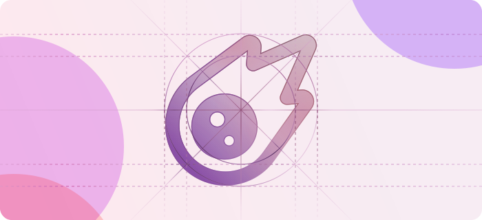
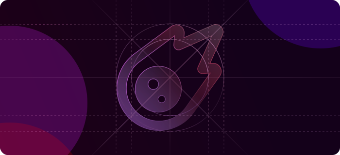

# Introduction

 

### Setting up

The first step to world-class documentation is setting up your editing environnments.

Get your docs set up locally for easy development. Preview your changes before you push to make sure they're perfect.

### Make it yours

Update your docs to your brand and add valuable content for the best user conversion.

Customize your docs to your company's colors and brands. Automatically generate endpoints from an OpenAPI spec. Build interactive features and designs to guide your users. Check out our showcase of our favorite documentation.

\----GitBook Added Content----

$$f(x) = x * e^{2 pi i \xi x}$$


Callout Green


<table data-view="cards"><thead><tr><th></th><th></th><th></th></tr></thead><tbody><tr><td></td><td>To Do 1</td><td></td></tr><tr><td></td><td>To Do 2</td><td></td></tr></tbody></table>



Tab 1



Tab 2



\----End----

